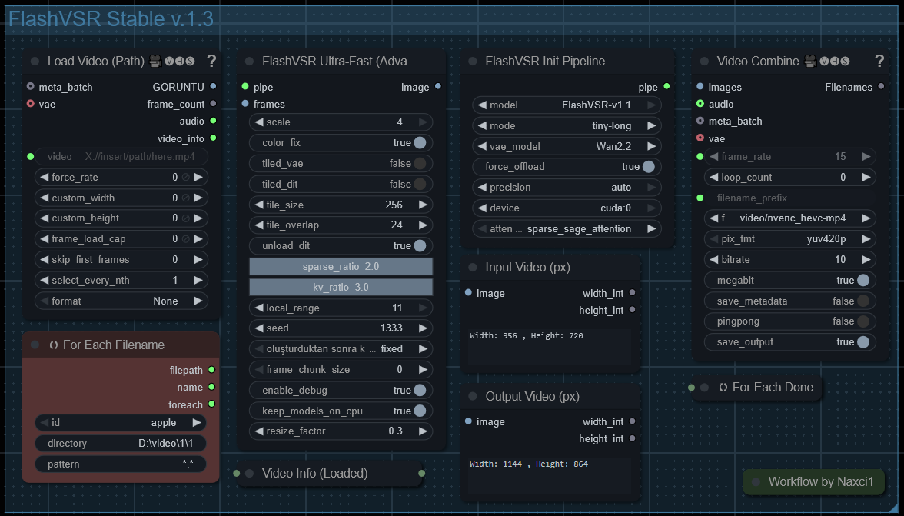

# ComfyUI-FlashVSR_Stable

**High-performance Video Super Resolution for ComfyUI with VRAM optimization.**

Run FlashVSR on 8GB-24GB+ GPUs without artifacts. Features intelligent resource management, 5 VAE options, and auto-downloading models.

[](LICENSE)
[](https://github.com/comfyanonymous/ComfyUI)

---

## ✨ Key Features

- **🎬 Video Super Resolution**: 2x or 4x upscaling using FlashVSR diffusion models
- **🧠 5 VAE Options**: Choose from Wan2.1, Wan2.2, LightVAE, TAE variants for optimal VRAM/quality trade-off
- **📊 Pre-Flight Resource Check**: Intelligent VRAM estimation with settings recommendations
- **⚡ Auto-Download**: Models download automatically from HuggingFace if missing
- **🛡️ OOM Protection**: Automatic recovery with progressive fallback (tiled VAE → tiled DiT → chunking)
- **🔧 Unified Pipeline**: All modes share optimized processing logic

---

## 📋 Quick Links

- [Changelog](CHANGELOG.md) - Full version history
- [Sample Workflow](./workflow/FlashVSR.json)
- [HuggingFace Models](https://huggingface.co/JunhaoZhuang/FlashVSR)

---

## Performance & VRAM Optimization

This node is optimized for various hardware configurations. Here are some guidelines:

### VRAM Tiers & Settings

| VRAM | Mode | Tiling | Chunk Size | Precision | Notes |
| :--- | :--- | :--- | :--- | :--- | :--- |
| **24GB+** | `full` or `tiny` | Disabled | 0 (All) | `bf16`/`auto` | Max quality/speed. |
| **16GB** | `tiny` | `tiled_vae=True` | 0 or ~100 | `bf16`/`auto` | Enable `keep_models_on_cpu`. |
| **12GB** | `tiny` | `tiled_vae=True`, `tiled_dit=True` | ~50 | `fp16` | Use `sparse_sage` attention. |
| **8GB** | `tiny-long` | **Required** | ~20 | `fp16` | Must use tiling and chunking. |

### Performance Enhancements
- **Attention Mode**: Use `sparse_sage_attention` for the best balance of speed and memory. `flash_attention_2` is faster but requires specific hardware/installation.
- **Precision**: `bf16` (BFloat16) is recommended for RTX 3000/4000/5000 series. It is faster and preserves dynamic range better than `fp16`.
- **Chunking**: Use `frame_chunk_size` to process videos in segments. This moves processed frames to CPU RAM, preventing VRAM saturation on long clips.
- **Resize Input**: If the input video is large (e.g., 1080p), use the `resize_factor` parameter to reduce input size to `0.5x` before processing. This drastically reduces VRAM usage and allows for 4x upscaling of the resized result (net 2x output). For small videos, leave at `1.0`.

### Pre-Flight Resource Check (NEW)

Before processing, FlashVSR now performs an intelligent pre-flight check that:

1. **Estimates VRAM Requirements**: Calculates approximate VRAM needed based on resolution, frames, scale, and settings.
2. **Checks Available Resources**: Uses `torch.cuda.mem_get_info()` for accurate real-time VRAM availability.
3. **Provides Recommendations**: If OOM is predicted, suggests optimal settings.

Example console output:
```
============================================================
🔍 PRE-FLIGHT RESOURCE CHECK
💻 RAM: 15.4GB / 95.8GB
💾 VRAM Available: 14.2GB
📊 Estimated VRAM Required: 12.8GB
✅ Safe to proceed. Estimated ~12.8GB needed, 14.2GB available.
============================================================
```

If VRAM is insufficient:
```
⚠️ Current settings require ~18.5GB but only 8.0GB available.
💡 Recommended Optimal Settings:
  • chunk_size = 32
  • tiled_vae = True
  • tiled_dit = True
  • resize_factor = 0.6
```

---

## 🎨 VAE Model Selection

### VAE Type Comparison

| VAE Type | VRAM Usage | Speed | Quality | Best For |
| :--- | :--- | :--- | :--- | :--- |
| **Wan2.1** | 8-12 GB | Baseline | ⭐⭐⭐⭐⭐ | Maximum quality, 24GB+ VRAM |
| **Wan2.2** | 8-12 GB | Baseline | ⭐⭐⭐⭐⭐ | Improved normalization for Wan2.2 models |
| **LightVAE_W2.1** | 4-5 GB | 2-3x faster | ⭐⭐⭐⭐ | 8-16GB VRAM, speed priority |
| **TAE_W2.2** | 6-8 GB | 1.5x faster | ⭐⭐⭐⭐ | Temporal consistency priority |
| **LightTAE_HY1.5** | 3-4 GB | 3x faster | ⭐⭐⭐⭐ | HunyuanVideo compatible, minimum VRAM |

### VAE Selection Guide

| Your VRAM | Recommended VAE | Additional Settings |
| :--- | :--- | :--- |
| **8GB** | `LightTAE_HY1.5` or `LightVAE_W2.1` | `tiled_vae=True`, `tiled_dit=True`, `chunk_size=16` |
| **12GB** | `LightVAE_W2.1` or `Wan2.1` | `tiled_vae=True` |
| **16GB** | Any VAE | Optional tiling for long videos |
| **24GB+** | `Wan2.1` or `Wan2.2` | Maximum quality, no restrictions |

### Auto-Download

All VAE models auto-download from HuggingFace if not found locally:

| VAE Selection | File | Direct Download Link |
| :--- | :--- | :--- |
| **Wan2.1** | `Wan2.1_VAE.pth` | [Download](https://huggingface.co/lightx2v/Autoencoders/blob/main/Wan2.1_VAE.pth) |
| **Wan2.2** | `Wan2.2_VAE.pth` | [Download](https://huggingface.co/lightx2v/Autoencoders/blob/main/Wan2.2_VAE.pth) |
| **LightVAE_W2.1** | `lightvaew2_1.pth` | [Download](https://huggingface.co/lightx2v/Autoencoders/blob/main/lightvaew2_1.pth) |
| **TAE_W2.2** | `taew2_2.safetensors` | [Download](https://huggingface.co/lightx2v/Autoencoders/blob/main/taew2_2.safetensors) |
| **LightTAE_HY1.5** | `lighttaehy1_5.pth` | [Download](https://huggingface.co/lightx2v/Autoencoders/blob/main/lighttaehy1_5.pth) |

---

## 📖 Best Practices / Settings Guide

### Low VRAM (8-12GB) Configuration

```
Mode: tiny-long
VAE: LightVAE_W2.1 or LightTAE_HY1.5
Tiled VAE: ✅ Enabled
Tiled DiT: ✅ Enabled
Chunk Size: 16-32
Resize Factor: 0.5-0.8
Keep Models on CPU: ✅ Enabled
```

### Medium VRAM (16GB) Configuration

```
Mode: tiny
VAE: Wan2.1 or LightVAE_W2.1
Tiled VAE: ✅ Enabled
Tiled DiT: Optional
Chunk Size: 50-100
Resize Factor: 1.0
Keep Models on CPU: Optional
```

### High VRAM (24GB+) Configuration

```
Mode: full or tiny
VAE: Wan2.1 or Wan2.2
Tiled VAE: ❌ Disabled
Tiled DiT: ❌ Disabled
Chunk Size: 0 (all frames)
Resize Factor: 1.0
Keep Models on CPU: ❌ Disabled
```

### Processing Summary

At the end of each run, you'll see a summary:

```
============================================================
📊 PROCESSING SUMMARY
⏱️ Total Processing Time: 130.08s (1.54 FPS)
📥 Input Resolution: 276x206 (200 frames)
📤 Output Resolution: 552x412 (200 frames)
📈 Peak VRAM Used: 12.4 GB
============================================================
```

---

## 🔧 Node Parameters

Hover over any input in ComfyUI to see tooltips. Full parameter list:

| Parameter | Description |
| :--- | :--- |
| **model** | FlashVSR model version |
| **mode** | `tiny` (fast), `tiny-long` (lowest VRAM), `full` (highest quality) |
| **vae_model** | VAE architecture (5 options, auto-download) |
| **scale** | Upscaling factor: 2x or 4x |
| **color_fix** | Wavelet color transfer. Highly recommended. |
| **tiled_vae** | Spatial tiling for VAE. Reduces VRAM, slower. |
| **tiled_dit** | Spatial tiling for DiT. Required for 4K output. |
| **tile_size** | Tile dimensions. Smaller = less VRAM. |
| **overlap** | Tile overlap for seamless blending. |
| **unload_dit** | Unload DiT before VAE decode. |
| **frame_chunk_size** | Process N frames at a time. 0 = all. |
| **enable_debug** | Verbose console logging. |
| **keep_models_on_cpu** | Offload to system RAM when idle. |
| **resize_factor** | To first reduce the size of large videos and then enlarge them, use a range of (0.3-1.0). |
| **attention_mode** | Attention kernel: `sparse_sage`, `flash_attention_2`, `sdpa`, `block_sparse` |

---

## 🚀 Installation

### Step 1: Install the Node

```bash
cd ComfyUI/custom_nodes
git clone https://github.com/naxci1/ComfyUI-FlashVSR_Stable.git
python -m pip install -r ComfyUI-FlashVSR_Stable/requirements.txt
```

> 📢 **Turing architecture or older GPUs (GTX 16 series, RTX 20 series, and earlier)**: Install `triton<3.3.0`:
> ```bash
> # Windows
> python -m pip install -U triton-windows<3.3.0
> # Linux
> python -m pip install -U triton<3.3.0
> ```

### Step 2: Download Models

Download the `FlashVSR` folder from [HuggingFace](https://huggingface.co/JunhaoZhuang/FlashVSR):

```
ComfyUI/models/FlashVSR/
├── LQ_proj_in.ckpt
├── TCDecoder.ckpt
├── diffusion_pytorch_model_streaming_dmd.safetensors
└── Wan2.1_VAE.pth  (or auto-downloads)
```

> 💡 **VAE files auto-download** from HuggingFace if not present. Only the DiT model and other components need manual download.

---

## 🖼️ Preview



### Sample Workflow

[Download Workflow JSON](./workflow/FlashVSR.json)

---

## 🏷️ Recent Changes

See [CHANGELOG.md](CHANGELOG.md) for full version history.

### v1.2.0 (2025-12-23)
- 🚀 Pre-Flight Resource Calculator with settings recommendations
- 🎨 5 VAE options: Wan2.1, Wan2.2, LightVAE_W2.1, TAE_W2.2, LightTAE_HY1.5
- ⬇️ Auto-download VAE models from HuggingFace
- 🐛 Fixed black borders and video corruption
- ⚡ Unified processing pipeline for all modes
- 🛡️ 95% VRAM threshold for OOM recovery

---

## 🙏 Acknowledgments

- [FlashVSR](https://github.com/OpenImagingLab/FlashVSR) @OpenImagingLab  
- [Sparse_SageAttention](https://github.com/jt-zhang/Sparse_SageAttention_API) @jt-zhang
- [ComfyUI](https://github.com/comfyanonymous/ComfyUI) @comfyanonymous
- [Wan2.2](https://github.com/Wan-Video/Wan2.2) @Wan-Video
- [LightX2V](https://github.com/ModelTC/LightX2V) @ModelTC
- [LightX2V Autoencoders](https://huggingface.co/lightx2v/Autoencoders) @lightx2v

---

## 📄 License

MIT License - see [LICENSE](LICENSE) for details.
